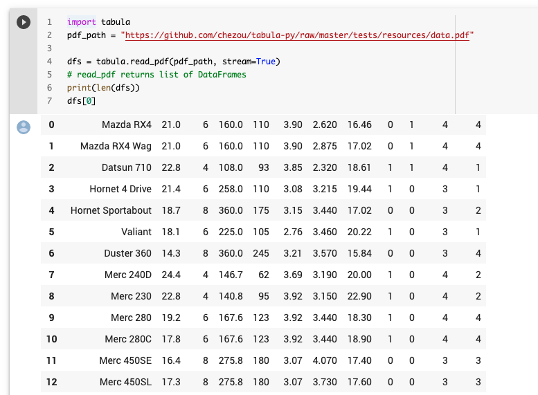

# tabula-py

[](https://travis-ci.org/chezou/tabula-py)
[](https://badge.fury.io/py/tabula-py)
[](https://tabula-py.readthedocs.io/en/latest/?badge=latest)
[](https://www.patreon.com/chezou)


`tabula-py` is a simple Python wrapper of [tabula-java](https://github.com/tabulapdf/tabula-java), which can read table of PDF.
You can read tables from PDF and convert into pandas's DataFrame. tabula-py also enables you to convert a PDF file into CSV/TSV/JSON file.

You can see [the example notebook](https://nbviewer.jupyter.org/github/chezou/tabula-py/blob/master/examples/tabula_example.ipynb) and try it on Google Colab, or we highly recommend to read [our document](https://tabula-py.readthedocs.io/en/latest/) especially for FAQ.




# Requirements

- Java 8+
- Python 3.5+

## OS

I confirmed working on macOS and Ubuntu. But some people confirm it works on Windows 10. See also [the document for the detailed installation for Windows 10](https://tabula-py.readthedocs.io/en/latest/getting_started.html#get-tabula-py-working-windows-10).

# Usage

- [Documentation](https://tabula-py.readthedocs.io/en/latest/)
  - [FAQ](https://tabula-py.readthedocs.io/en/latest/faq.html) would be helpful if you have issue
- [Example notebook on Google Colaboratory](https://colab.research.google.com/github/chezou/tabula-py/blob/master/examples/tabula_example.ipynb)

## Install

Ensure you have Java runtime and set PATH for it.

```bash
pip install tabula-py
```

## Example

tabula-py enables you to extract table from PDF into DataFrame and JSON. It also can extract tables from PDF and save file as CSV, TSV or JSON.

```py
import tabula

# Read pdf into DataFrame
df = tabula.read_pdf("test.pdf", pages='all')

# Read remote pdf into DataFrame
df2 = tabula.read_pdf("https://github.com/tabulapdf/tabula-java/raw/master/src/test/resources/technology/tabula/arabic.pdf")

# convert PDF into CSV
tabula.convert_into("test.pdf", "output.csv", output_format="csv", pages='all')

# convert all PDFs in a directory
tabula.convert_into_by_batch("input_directory", output_format='csv', pages='all)
```

See [example notebook](./examples/tabula_example.ipynb) for more detail. I also recommend to read [the tutorial article](https://aegis4048.github.io/parse-pdf-files-while-retaining-structure-with-tabula-py) written by [@aegis4048](https://github.com/aegis4048).


## Contributing

Interested in helping out? I'd love to have your help!

You can help by:

- [Reporting a bug](https://github.com/tabulapdf/tabula-py/issues).
- Adding or editing documentation.
- Contributing code via a Pull Request. See also [for the contribution](docs/contributing.rst)
- Write a blog post or spreading the word about `tabula-py` to people who might be able to benefit from using it.


### Contributors

- [@lahoffm](https://github.com/lahoffm)
- [@jakekara](https://github.com/jakekara)
- [@lcd1232](https://github.com/lcd1232)
- [@kirkholloway](https://github.com/kirkholloway)
- [@CurtLH](https://github.com/CurtLH)
- [@nikhilgk](https://github.com/nikhilgk)
- [@krassowski](https://github.com/krassowski)
- [@alexandreio](https://github.com/alexandreio)
- [@rmnevesLH](https://github.com/rmnevesLH)
- [@red-bin](https://github.com/red-bin)
- [@Gallaecio](https://github.com/Gallaecio)

### Another support

You can also support our continued work on `tabula-py` with a donation [on Patreon](https://www.patreon.com/chezou).
